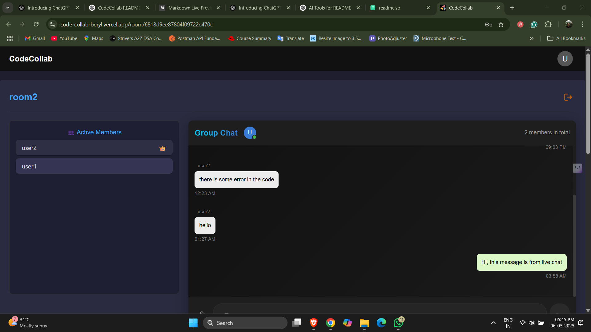
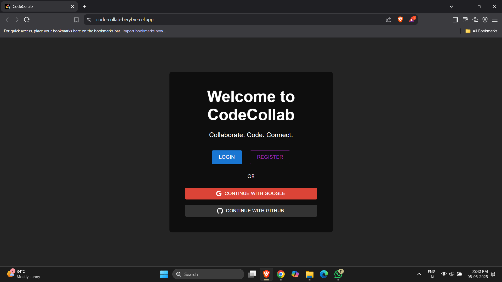

# 🚀 CodeCollab

> **A Real-Time Code Collaboration Platform with Chat and Media Sharing**


**CodeCollab** is a powerful full-stack web application designed to enable developers to **collaborate on code in real-time**, **chat instantly**, and **share media**, all in one unified workspace. It’s ideal for interviews, pair programming, remote teaching, and technical discussions.

<br/>

## 🧠 Features

- ✅ **Real-Time Code Editor** (supports syntax highlighting)
- 🧑‍💻 **Multi-User Collaboration** with live typing visibility
- 💬 **Real-Time Chat Messaging**
- 📁 **Media/File Sharing**
- 🕒 **Join via Room Code**
- 🌐 **Socket.io powered low-latency communication**
- 🎨 Clean and Responsive UI

<br/>


## 🛠️ Tech Stack

| Frontend | Backend | Realtime | Styling | Deployment |
|----------|---------|----------|---------|------------|
| React.js | Node.js  | Socket.io | Material UI | [Vercel](https://vercel.com) / [Render](https://render.com) |
| CodeMirror | Express | WebSockets | Toast notificatoins | [MongoDB Atlas](https://www.mongodb.com/cloud/atlas) |
| Context API | MongoDB | Piston API | 

<br/>

## 📦 Setup Instructions

1. **Clone the repository**
   ```bash
   git clone https://github.com/Ashish-Redhu/CodeCollab
   cd CodeCollab
   ```
2. **Install Dependencies**
  ```bash
   cd client
   npm install
   cd ../server
   npm install
   ```
3. **Set up .env files for both client and server folders**

3.i) **Server Configuration** 
```
PORT=5000
SERVER_URL=http://localhost:5000
CLIENT_URL=http://localhost:3000
```

3.ii) **Database**
```
MONGO_URI=your_mongodb_connection_string
```
3.iii) **Authentication**
```
JWT_SECRET=your_jwt_secret_key
```

3.iv) **OAuth Providers**
```
GOOGLE_CLIENT_ID=your_google_client_id
GOOGLE_CLIENT_SECRET=your_google_client_secret
GITHUB_CLIENT_ID=your_github_client_id
GITHUB_CLIENT_SECRET=your_github_client_secret
```

3.v) **Cloudinary**
```
CLOUD_NAME=your_cloud_name
CLOUD_API_KEY=your_api_key
CLOUD_API_SECRET=your_api_secret
```

3.vi) **Email**
```
EMAIL_USER=your_email@domain.com
EMAIL_PASS=your_email_password
```


## 📁 Folder Structure 
CodeCollab/ <br>
├── client/&nbsp; &nbsp; &nbsp; &nbsp; &nbsp; &nbsp; &nbsp; &nbsp;   &nbsp; &nbsp; &nbsp; &nbsp; &nbsp; &nbsp;&nbsp;&nbsp;&nbsp;&nbsp;&nbsp;&nbsp;&nbsp;&nbsp;&nbsp;&nbsp;&nbsp;&nbsp;&nbsp;&nbsp;&nbsp;&nbsp;&nbsp;&nbsp;&nbsp;&nbsp;&nbsp;&nbsp;&nbsp;&nbsp;&nbsp;&nbsp;&nbsp;&nbsp;&nbsp;&nbsp;&nbsp;&nbsp;&nbsp;&nbsp;&nbsp;&nbsp;&nbsp;&nbsp;&nbsp;&nbsp;&nbsp;&nbsp;&nbsp;&nbsp;&nbsp;&nbsp;# Frontend code <br>
│   ├── public/&nbsp;&nbsp;&nbsp;&nbsp; &nbsp; &nbsp; &nbsp; &nbsp; &nbsp; &nbsp; &nbsp;   &nbsp; &nbsp; &nbsp; &nbsp; &nbsp;# Static assets<br>
│   ├── src/&nbsp;&nbsp;&nbsp;&nbsp; &nbsp; &nbsp; &nbsp; &nbsp; &nbsp; &nbsp; &nbsp;   &nbsp; &nbsp; &nbsp; &nbsp; &nbsp; &nbsp; &nbsp; &nbsp;# Source code<br>
│   │   ├── components/     &nbsp; &nbsp; &nbsp; &nbsp; &nbsp; &nbsp;&nbsp;&nbsp;&nbsp;   # Reusable components<br>
│   │   ├── Pages/       &nbsp; &nbsp; &nbsp; &nbsp; &nbsp; &nbsp; &nbsp; &nbsp;   &nbsp; &nbsp;&nbsp;&nbsp;&nbsp;&nbsp;&nbsp;&nbsp;       # Application pages<br>
│   │   ├── styles/&nbsp;&nbsp; &nbsp; &nbsp; &nbsp; &nbsp; &nbsp; &nbsp; &nbsp;   &nbsp; &nbsp; &nbsp; &nbsp;&nbsp;&nbsp;&nbsp;&nbsp;# CSS and styling files<br>
│   │   ├── App.jsx      &nbsp; &nbsp; &nbsp; &nbsp; &nbsp; &nbsp; &nbsp; &nbsp;   &nbsp; &nbsp; &nbsp; &nbsp; &nbsp;&nbsp;        # Main application component<br>
│   │   ├── main.jsx&nbsp; &nbsp; &nbsp; &nbsp; &nbsp; &nbsp; &nbsp; &nbsp;   &nbsp; &nbsp; &nbsp; &nbsp; &nbsp;&nbsp;&nbsp;&nbsp;# Entry point for React<br>
│   │   └── index.css&nbsp; &nbsp; &nbsp; &nbsp; &nbsp; &nbsp; &nbsp; &nbsp;   &nbsp; &nbsp; &nbsp; &nbsp; &nbsp; &nbsp;;# Global styles<br>
│   ├── package.json&nbsp; &nbsp; &nbsp; &nbsp; &nbsp; &nbsp; &nbsp; &nbsp;   &nbsp; &nbsp; &nbsp; &nbsp; &nbsp;# Frontend dependencies<br>
│   └── vite.config.js&nbsp; &nbsp; &nbsp; &nbsp; &nbsp; &nbsp; &nbsp; &nbsp;   &nbsp; &nbsp; &nbsp; &nbsp; &nbsp; &nbsp;# Vite configuration<br>
│<br>
├── server/          &nbsp; &nbsp; &nbsp; &nbsp;&nbsp;&nbsp;&nbsp;&nbsp;&nbsp;&nbsp;&nbsp;&nbsp;&nbsp;&nbsp;&nbsp;&nbsp;&nbsp;&nbsp;&nbsp;&nbsp;&nbsp;&nbsp;&nbsp;&nbsp;&nbsp;&nbsp;&nbsp;&nbsp; # Backend code<br>
│   ├── src/<br>
│   │   ├── controllers/    &nbsp; &nbsp; &nbsp; &nbsp; &nbsp; &nbsp; &nbsp; &nbsp;   &nbsp; &nbsp; &nbsp; &nbsp; &nbsp; &nbsp; &nbsp; &nbsp;     # API controllers<br>
│   │   ├── middleware/   &nbsp; &nbsp; &nbsp; &nbsp; &nbsp; &nbsp; &nbsp; &nbsp;   &nbsp; &nbsp; &nbsp; &nbsp; &nbsp; &nbsp; &nbsp;      # Middleware functions<br>
│   │   ├── models/      &nbsp; &nbsp; &nbsp; &nbsp; &nbsp; &nbsp; &nbsp; &nbsp;   &nbsp; &nbsp; &nbsp; &nbsp; &nbsp; &nbsp; &nbsp; &nbsp; &nbsp; &nbsp;      # Database models<br>
│   │   ├── routes/     &nbsp; &nbsp; &nbsp; &nbsp; &nbsp; &nbsp; &nbsp; &nbsp;   &nbsp; &nbsp; &nbsp; &nbsp; &nbsp; &nbsp; &nbsp; &nbsp;&nbsp; &nbsp;&nbsp;&nbsp;       # API routes<br>
│   │   ├── utils/    &nbsp; &nbsp; &nbsp; &nbsp; &nbsp; &nbsp; &nbsp; &nbsp;   &nbsp; &nbsp; &nbsp; &nbsp; &nbsp; &nbsp; &nbsp; &nbsp; &nbsp;&nbsp;&nbsp;&nbsp;&nbsp;&nbsp;&nbsp;        # Utility functions<br>
│   │   └── app.js&nbsp;&nbsp;&nbsp;&nbsp;&nbsp;&nbsp;&nbsp;&nbsp;&nbsp;&nbsp;&nbsp;&nbsp;&nbsp; &nbsp; &nbsp; &nbsp;   &nbsp; &nbsp; &nbsp; &nbsp;  &nbsp; &nbsp; &nbsp;&nbsp;&nbsp;&nbsp;&nbsp;&nbsp;&nbsp;# Express application setup<br>
│   ├── .env          &nbsp; &nbsp; &nbsp; &nbsp; &nbsp; &nbsp; &nbsp; &nbsp;   &nbsp; &nbsp; &nbsp; &nbsp; &nbsp; &nbsp; &nbsp; &nbsp; &nbsp;&nbsp;&nbsp;&nbsp;&nbsp;&nbsp;&nbsp;&nbsp;&nbsp;&nbsp;&nbsp;# Environment variables<br>
│   ├── package.json    &nbsp; &nbsp; &nbsp; &nbsp; &nbsp; &nbsp; &nbsp; &nbsp;   &nbsp; &nbsp; &nbsp; &nbsp; &nbsp; &nbsp;    # Backend dependencies<br>
│   └── server.js      &nbsp; &nbsp; &nbsp; &nbsp; &nbsp; &nbsp; &nbsp; &nbsp;   &nbsp; &nbsp; &nbsp; &nbsp; &nbsp; &nbsp; &nbsp; &nbsp;&nbsp;&nbsp;&nbsp;        # Server entry point<br>
│<br>
├── README.md               &nbsp; &nbsp; &nbsp; &nbsp; &nbsp; &nbsp; &nbsp; &nbsp;   &nbsp; &nbsp; &nbsp; &nbsp; &nbsp; &nbsp; &nbsp; &nbsp;     # Project documentation<br>
└── .gitignore          &nbsp; &nbsp; &nbsp; &nbsp; &nbsp; &nbsp; &nbsp; &nbsp;   &nbsp; &nbsp; &nbsp; &nbsp; &nbsp; &nbsp; &nbsp; &nbsp;         # Files and directories to ignore in Git<br>

## 📸 Screenshots

| Code Editor | Real-Time Chat | Media Sharing |
|-------------|----------------|----------------|
|  |  |  |

<br/>

## 🙋‍♂️ Author
**Ashish Redhu** <br>
[🔗 LinkedIn](https://www.linkedin.com/in/ashish-redhu/)  
[</> LeetCode](https://leetcode.com/u/AshishRedhu/)  
[🌐 GitHub](https://github.com/Ashish-Redhu)

